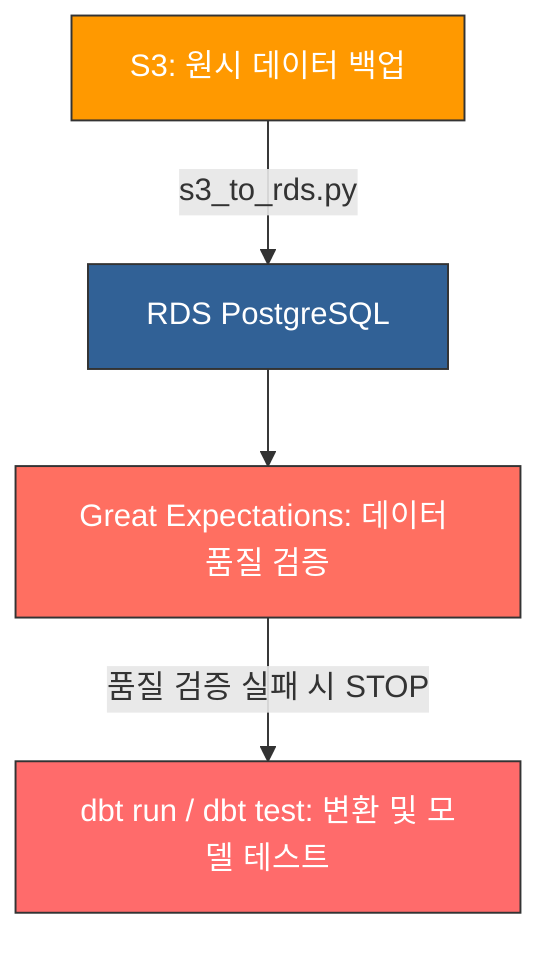

 🚀 DE_practice — 데이터 엔지니어링 5주 집중 훈련

로컬 수작업 환경에서 시작하여 **24/7 무인 자동화 클라우드 파이프라인**으로 진화해 나가는 5주간의 실무 집중 훈련 기록입니다.

* **성장 경로:** `SQL` ➡️ `ETL` ➡️ `시계열 분석` ➡️ `통계 검증` ➡️ `dbt/GE 품질 관리` ➡️ `AWS 클라우드 이주`

<br />

## 📅 주차별 학습 로드맵


| 주차 | 핵심 주제 | 상세 내용 | 사용 기술 |
| :--- | :--- | :--- | :--- |
| **1주차** | **SQL 심화 + ETL 기초** | 고급 쿼리 작성 및 기초 데이터 추출·변환·적재 구조 이해 | `PostgreSQL`, `pandas`, `JOIN/CTE/GROUP BY` |
| **2주차** | **시계열 + 센서 데이터** | 시계열 롤링 윈도우 및 센서 데이터 전처리 기술 습득 | `pandas`, `matplotlib`, `이동평균/리샘플링` |
| **3주차** | **통계 기반 데이터 검증** | 데이터의 신뢰성 확보를 위한 통계적 가설 검증 프로세스 | `가설검정`, `t-test`, `상관/회귀 분석` |
| **4주차** | **데이터 모델링 + 품질 검증** | 현대적 데이터 분석 엔지니어링 및 데이터 품질 파이프라인 | `dbt`, `Great Expectations`, `Incremental/Snapshot` |
| **5주차** | **클라우드 이주 + 자동화** | 로컬 파이프라인의 AWS 클라우드 이주 및 스케줄링 무인화 | `AWS EC2·RDS·S3`, `Apache Airflow`, `Linux cron` |

---

## 🏗️ 핵심 파이프라인 구조 (5주차 최종 아키텍처)

> **스케줄 정보:** ⏱️ 매일 새벽 04:00 (KST) Airflow DAG를 통해 무인 자동 실행됩니다.



---

## 📂 dbt (Data Build Tool) 모델 구조

효율적인 데이터 변환과 증분 적재를 위해 계층별로 모델 구조를 분리하여 설계했습니다.

```text
models/
├── staging/
│   ├── stg_orders.sql            # 원시 주문 데이터 정제 및 1차 가공 (View)
│   └── stg_customers.sql         # 원시 고객 데이터 정제 및 1차 가공 (View)
└── marts/
    ├── fct_orders.sql            # 핵심 비즈니스 팩트 테이블 (전체 적재)
    └── fct_orders_incremental.sql # 대용량 대응 최적화 테이블 (증분 적재: unique_key + is_incremental)
```
